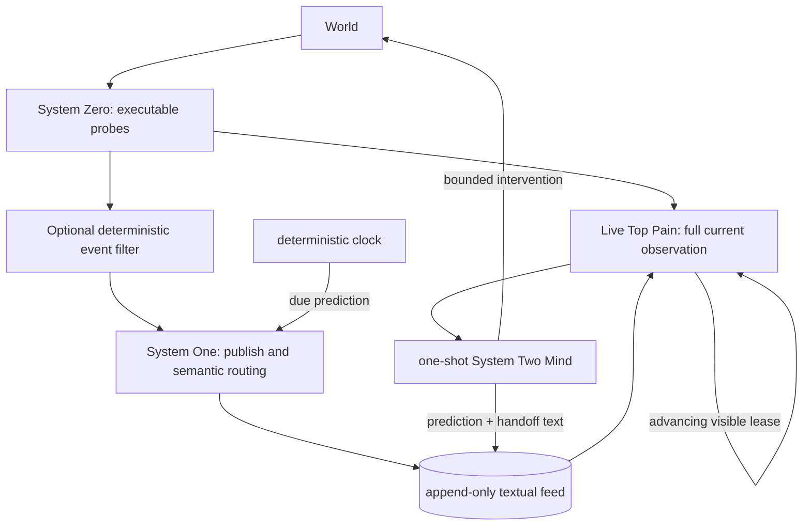

# mishe-tauftauf

A runnable, provider-neutral reference core for coordinating disposable LLM agents through ordinary UTF-8 text.

## Three systems, one observable loop



**System Zero** measures the world. **System One** makes narrow probabilistic judgments about publishing, relevance, attempts, waiting, predictions, and desired state. A **System Two Mind** is a one-shot process that reads its current surface, reasons, acts through its configured harness, writes a textual handoff, and exits.

A **Top Pain** is the current output of a live executable renderer. It is simultaneously context, attention, and a semantic routing address. It is not a stored file. Its persistent window survives while Minds are ephemeral. Every frame retains the complete renderer output and adds an advancing lease; filtering operates only on a separate copy.

Durable truth is limited to the world, source code, executable renderers and Mind harnesses, the append-only `feed`, current human-readable observations, plans, handoffs, and optional textual projections. There are no tasks, workflow states, vector stores, hidden cursors, prediction databases, or serialized model requests. If something can remain text, it remains text.

“Text-only” governs durable truth and interfaces. It does not claim Python source, transient parsed values, probabilities, file descriptors, or in-memory model tensors are text stores.

## Quickstart

```bash
python -m venv .venv
.venv/bin/pip install -e .
export MISHE_TAUFTAUF_HOME="$PWD/.mishe-tauftauf"
mishe-tauftauf init

cat > "$MISHE_TAUFTAUF_HOME/top-pains/example" <<'SH'
#!/bin/sh
printf '%s\n' 'DESIRED STATE: probe reads the fixture' 'UNRESOLVED: no reading yet'
SH
chmod +x "$MISHE_TAUFTAUF_HOME/top-pains/example"

mishe-tauftauf check example -- sh -c 'printf "reading=42\n"'
mishe-tauftauf pain render example
mishe-tauftauf run --once --launcher headless
mishe-tauftauf feed
```

For persistent visual surfaces:

```bash
mishe-tauftauf tmux start
mishe-tauftauf run --follow --launcher tmux
```

Each tmux window keeps a live Top Pain above a disposable Mind pane. The top lease advances even if the value is stable. `doctor --panes` verifies advancement; a static footer is not evidence of a fresh sensor reading.

## Observation and intervention

Observation and event selection are separate branches. An optional executable `filters/<slug>` receives temporary previous/current observation files. It may reduce event traffic, but never changes or hides the Top Pain. Errors render UNKNOWN and fail toward publishing.

Every corrective intervention is red-first:

1. Exercise a real System Zero check for the desired observable behavior.
2. Wire its verdict into a live Top Pain and observe red or UNKNOWN.
3. State a hypothesis, intervention, predicted consequence, and exactly one `Check at: YYYY-MM-DDTHH:MM:SSZ` line.
4. Apply the bounded intervention and rerun the same check.
5. Observe the actual result on the same surface.

A model approval, patch, exit code, feed receipt, checked box, or advancing pane lease cannot substitute for observed behavior. Missing, stale, frozen, malformed, or unsupported evidence is UNKNOWN.

Predictions are ordinary feed prose. A deterministic clock checks them even when the pane has not changed. Matching an intermediate prediction is progress, not completion; only fresh evidence of the desired state resolves follow-through. Several independent predictions may coexist and survive restart by replaying text.

## Provider-neutral judgments

`run --judge PATH` selects an executable text adapter. It receives a document containing `QUESTION`, `INSTRUCTIONS`, `TOP PAIN`, `EVIDENCE`, and optionally `PREDICTION`; it returns one line: `probability P` or `unknown reason`. Output is data and is never executed.

The optional Laya adapter uses `laya==0.3.5` and `convaiinnovations/laya`'s `typed-decisions` subfolder through its native `noul` API. Its probabilities are **not deployment calibration**. The low 0.20 publish/relevance threshold is a loss-avoidance policy, not a quality claim. Production startup controls can disable a failing question only by making it explicit UNKNOWN, which escalates rather than manufacturing certainty.

## Adapter contracts

- `top-pains/<slug>`: executable, no arguments, complete UTF-8 frame on stdout.
- `filters/<slug>`: executable, previous and current temporary text paths; exit 0 passes, 1 holds, anything else passes with visible UNKNOWN.
- `minds/<slug>` or `minds/default`: executable, complete invocation context on stdin; stdout/stderr are history, not commands.
- external judge: executable, judgment document on stdin; exactly one result line on stdout.
- tmux: default visual and launch adapter, but not an ontology or a dependency for headless operation.

## License

CC0 1.0 Universal. See `LICENSE`.
